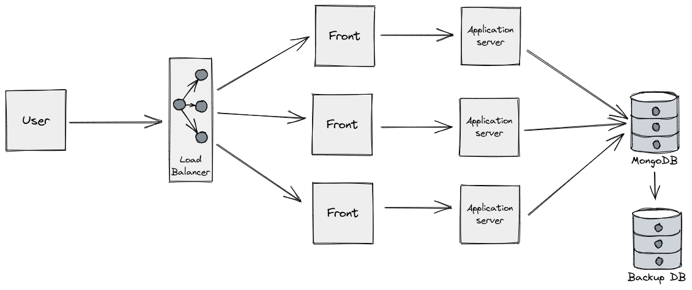

# Proyecto Sistemas Distribuidos

Proyecto de una aplicacion basado en una arquitectura de sistemas distribuidos

  <a href="url"></a>

## Configuracion de Entorno de Desarrollo
---

### PreRequisitos:

- Docker Engine

### Configuracion de Proyecto
---

## Descarga de Imagenes de DockerHub

```
docker pull node
docker pull mongo
docker pull nginx
```

## Creacion de Red de Comunicacion de Contenedores

```
docker network create --subnet=192.168.10.0/24 --gateway=192.168.10.1 redg1
```

## Construiccion y Ejecucion de Imagenes (DockerFile)
---

*MongoDB*

```
docker run -itd --name MongoDB --network redg1 --ip 192.168.10.10 mongo
```

*Node Backend Node-Express* 

Imagenes Dockerfile:

```
docker build -t backapp_1 --build-arg port=3010 .
docker build -t backapp_2 --build-arg port=3020 .
docker build -t backapp_3 --build-arg port=3030 .
```

Ejecucion Imagenes:
```
docker run -itd --name NodeBack_1 --network redg1 --ip 192.168.10.20 -e PORT=3010 -e IP_DB=192.168.10.10 backapp_1 npm start

docker run -itd --name NodeBack_2 --network redg1 --ip 192.168.10.21 -e PORT=3020 -e IP_DB=192.168.10.10 backapp_2 npm start

docker run -itd --name NodeBack_3 --network redg1 --ip 192.168.10.22 -e PORT=3030 -e IP_DB=192.168.10.10 backapp_3 npm start
```

*Node Frontend Node-Angular*

Creacion de Imagenes:
```
docker build -t frontapp_1 --build-arge port=4010
docker build -t frontapp_2 --build-arge port=4020
docker build -t frontapp_3 --build-arge port=4030
```

Ejecucion de Imagenes:
```
docker run -it -d --name FrontApp_1 --network redg1 --ip 192.168.10.30 -e IP=192.168.10.30 -e PORT=4010 frontapp_1 npm start

docker run -it -d --name FrontApp_2 --network redg1 --ip 192.168.10.31 -e IP=192.168.10.31 -e PORT=4020 frontapp_2 npm start

docker run -it -d --name FrontApp_3 --network redg1 --ip 192.168.10.32 -e IP=192.168.10.32 -e PORT=4030 frontapp_3 npm start
```

Editar codigo `src/app/service/data.service.ts` con las direccion IP y puertos asignados a las diferentes API's ejem:
```
docker exec -it FrontApp_1 bash
```

```
readonly URL_API = `http://192.168.10.20:3010/api/lab`;
```

NOTA: Se debe editar el codigo de cada contenedor y conectar a la API que guste, pero por organizacion 
- FrontApp_1 vincular con BackApp_1  "192.168.10.20:3010"
- FrontApp_2 vincular con BackApp_2  "192.168.10.21:3020"
- FrontApp_3 vincular con BackApp_3  "192.168.10.22:3030"

*Load Balancer Nginx*

```
docker build -t nginxlb .
docker run -itd --name NginxLB --network redg1 --ip 192.168.10.40 -p 80:80 nginxlb
```

## Docker Compose
---

<!-- **Configuracion Backend API**
---

Modo de interaccion shell del contenedor

```
docker exec -it NodeBack bash
```

Ejecucion de aplicacion Node en el contenedor

```
cd /home/node
npm install -f
npm run dev
``` -->

<!-- **Configuracion Frontend USER**
---

Modo de interaccion shell del contenedor

```
docker exec -it NodeFront bash
```

Ejecucion de aplicacion Node en el contenedor

```
cd /home/node
npm install -f
npm install -g @angular/cli@14.0.0
ng serve --host 192.168.100.30 --port 4200 --disable-host-check
```

**Configuracion Load Balancer Nginx**
---

```
cd /etc/nginx
nano nginx.conf
```
```
user nginx;
worker_processes auto;

error_log /var/log/nginx/error_log notice;
pid /var/run/nginx.pid;

events {
    worker_processes 1024;
}

http {
    include /etc/nginx/mime.type;
    default_type application/octet-stream;

    log_format main '$remote_addr - $remote_user [$time_local] "$requuest" '
                    '$status $body_bytes_sent "$http_referer" '
                    '"$http_user_agent" "$http_x_forwared_for';

    access_log /var/log/nginx/access_log main;

    sendfile        on;

    keepalive_timeout   65;

    upstream services {
        server 192.168.100.30:4200;
        server 192.168.100.31:4200;
        server 192.168.100.32:4200;
    }

    server {
        location / {
            proxy_pass http://services;
        }
    }
}
```
```
docker restart NginxLB
``` -->

